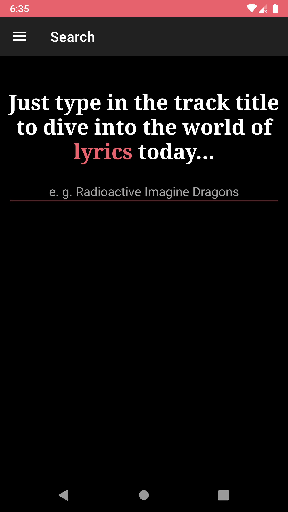
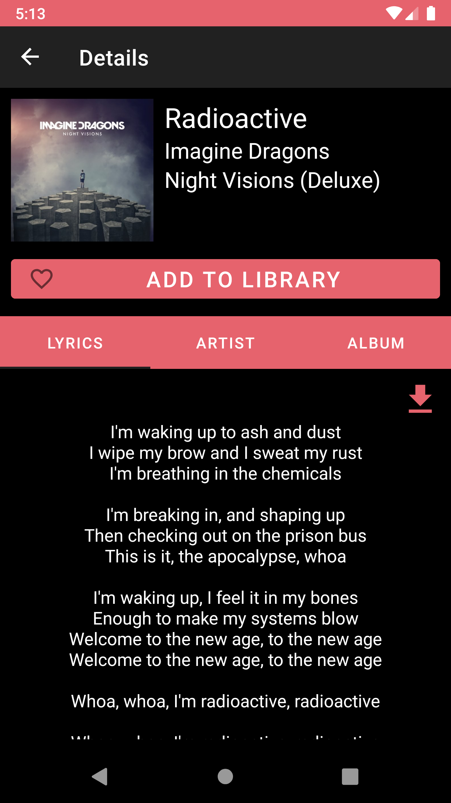
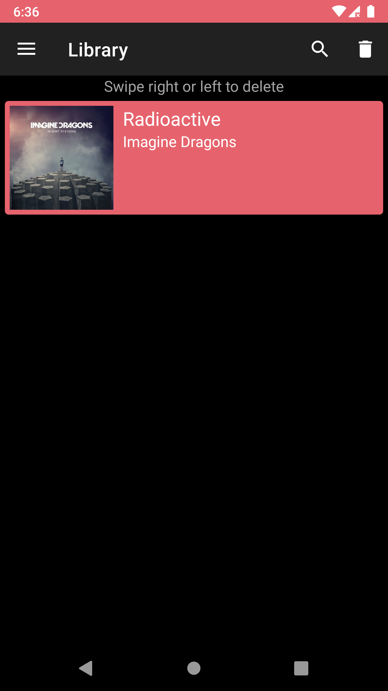

# FlexingLyrics
FlexingLyrics is an Android MVVM sample application created for learning purposes only.\
This application is based on [Happi.dev](https://happi.dev/) API and provides users with the ability to search information about tracks: lyrics, artist information, album information.

## Screenshots
<p float="left">
  
   
  
</p>

## Screen record
[Screen record](https://user-images.githubusercontent.com/43935139/160253647-8c365434-017a-40cc-9fd0-a8b3f084e5bd.mp4)

## Tech stack and concepts
* **[Kotlin](https://kotlinlang.org/)** as programming language.
* **[Kotlin coroutines](https://kotlin.github.io/kotlinx.coroutines/kotlinx-coroutines-core/)** as framework for asynchronous jobs (**[RxJava](https://github.com/ReactiveX/RxJava)** as its alternative (/Dagger2+RxJava branch)).
* Single activity support.
  * **[Fragments](https://developer.android.com/jetpack/androidx/releases/fragment)**.
  * **[Navigation components](https://developer.android.com/jetpack/androidx/releases/navigation)**.
* Modern UI toolkit.
  * **[Material components](https://material.io/develop/android)**.
  * **ViewBinding** for binding .xml views to objects in Activities and Fragments.
* API-based remote data layer.
  * **[Retrofit](https://square.github.io/retrofit/)** for network queries.
  * **[GSON](https://github.com/google/gson)** for parsing JSON.
* **[Room](https://developer.android.com/jetpack/androidx/releases/room)** for local data layer.
* **[Lifecycle components](https://developer.android.com/jetpack/androidx/releases/lifecycle)**.
  * **ViewModel** for implementing MVVM pattern.
  * **Livedata** as lifecycle-aware observable for UI layer.
* **[WorkManager](https://developer.android.com/reference/androidx/work/WorkManager)** for background work.
* **[Glide](https://github.com/bumptech/glide)** for working with images.
* Testing.
  * **JUnit**.
  * **[Android testing library](https://developer.android.com/jetpack/androidx/releases/test)**.
  * **Espresso** for UI-testing.
  * **Mockito** for mocking third-party classes (e.g. *NavController*).
  * Specific testing artifacts for other libraries.
* **[Hilt](https://dagger.dev/hilt/)** for dependency injection (**[Dagger 2](https://dagger.dev/)** as its alternative (/Dagger2+RxJava branch)).

## Key features
#### i.e. what is unique among other samples?
* Query-based search requests (API and local storage).
* **Livedata** usage.
* **DrawerLayout** implementation.
* **ViewPager** with **TabLayout** implementation for sub-fragments.
  * **Shared ViewModel** usage for the communication between such fragments.
* **WorkManager** implementation for long-term background work (saving an image of lyrics).
  * Utility functions for creating bitmap from some text and downloading it to the device storage.

## How to build?
In order to build the application you need to provide an API key:
1. Get it from [Happi.dev](https://happi.dev/).
2. Create file `credentials.properties`
3. Insert your key as 
```
API_KEY = "YOUR_API_KEY"
```

## License
```
MIT License

Copyright (c) 2022 Shvyndia Andrii

Permission is hereby granted, free of charge, to any person obtaining a copy
of this software and associated documentation files (the "Software"), to deal
in the Software without restriction, including without limitation the rights
to use, copy, modify, merge, publish, distribute, sublicense, and/or sell
copies of the Software, and to permit persons to whom the Software is
furnished to do so, subject to the following conditions:

The above copyright notice and this permission notice shall be included in all
copies or substantial portions of the Software.

THE SOFTWARE IS PROVIDED "AS IS", WITHOUT WARRANTY OF ANY KIND, EXPRESS OR
IMPLIED, INCLUDING BUT NOT LIMITED TO THE WARRANTIES OF MERCHANTABILITY,
FITNESS FOR A PARTICULAR PURPOSE AND NONINFRINGEMENT. IN NO EVENT SHALL THE
AUTHORS OR COPYRIGHT HOLDERS BE LIABLE FOR ANY CLAIM, DAMAGES OR OTHER
LIABILITY, WHETHER IN AN ACTION OF CONTRACT, TORT OR OTHERWISE, ARISING FROM,
OUT OF OR IN CONNECTION WITH THE SOFTWARE OR THE USE OR OTHER DEALINGS IN THE
SOFTWARE.
```
